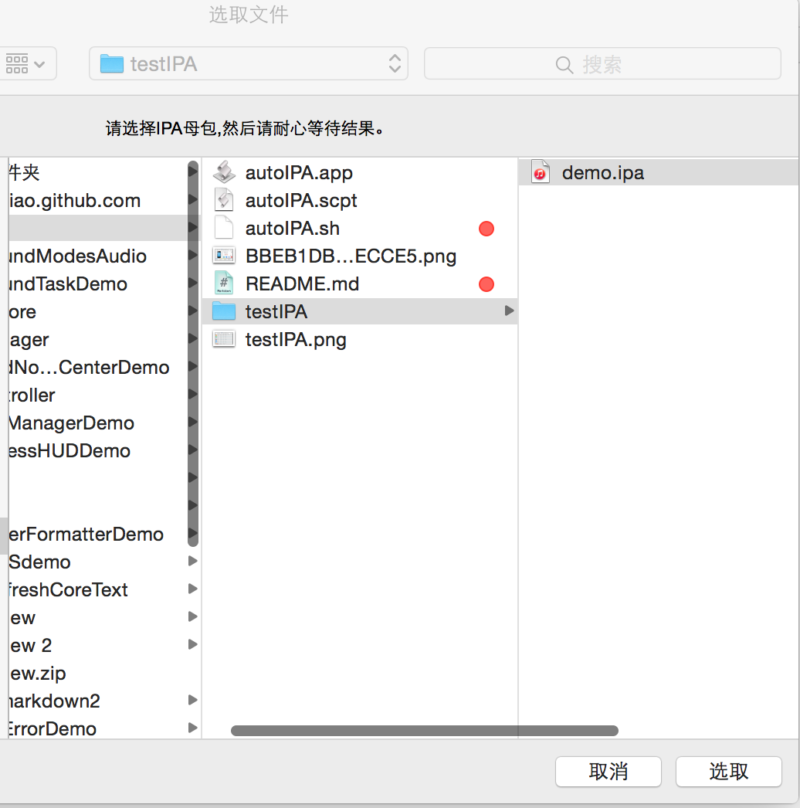
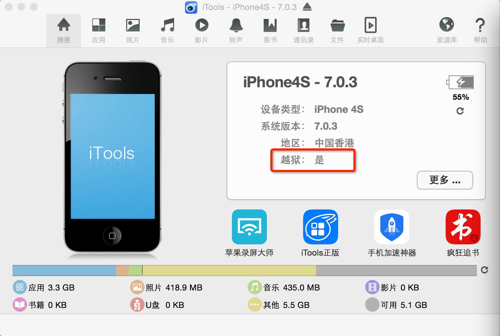
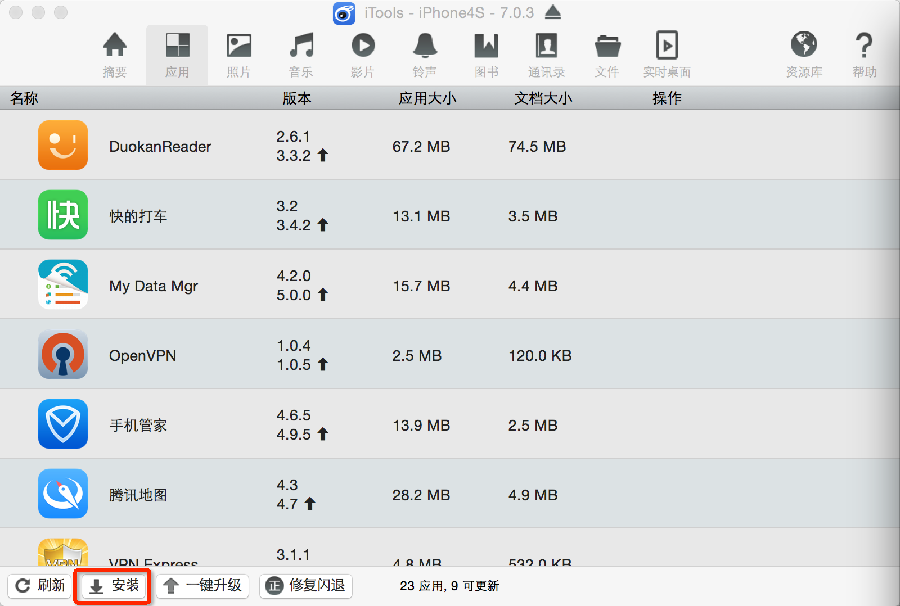

####一. 使用autoIPA.app生成渠道包
1. 双击autoIPA.app运行。

2. 选择testIPA中的demo.ipa，然后开始自动生成。

3. 渠道包生成完成会自动弹框提示。

4. 最后会生成所有渠道包的zip文件，命名规则为:
	
		规则: ${bundleName}_${versionShort}_${ChannelNo}_${ChanneName}.zip
		即如: 应用包名_短版本号_渠道号_渠道名.zip
		实例: 百度视频_4.0.0_104_同步推.zip

####二. 使用autoIPA.sh生成渠道包
在终端中调用以下代码,ipa母包路径作为sh文件运行参数。

	/Users/xxxx/new/autoIPA.sh yyyy/zzzz/demo.ipa
distDir目录中就是打好的所有的IPA包。

>如果Info.plist文件读取失败，则从app目录中拷贝Info.plist到别处并修改sh文件再运行即可。
>sh文件和ipa文件路径中要避免出现特殊字符，否则会导致脚本运行失败。

####三. 已有脚本的问题及本次改进
1. 在程序中使用AppConfig.plist文件存储所有渠道数据及当前渠道数据,渠道信息管理方便。plist是格式化信息的存储类型,查看、编辑、读取信息比较方便。

2. 已有脚本需要每次修改sh文件中参数，新脚本直接从ipa母包中读取程序基本
信息打包。

3. 通用性好,任何项目无需修改即可使用(程序必须使用指定格式的AppConfig.plist文件存储渠道信息)。

4. 由于程序的特殊性,同一个渠道可能会需要多个渠道id: 比如，公司自有服务器上91渠道id为103，	而其他appcpa平台如TalkingData上为91分配的渠道id为91_1，友盟等平台又不一样。AppConfig.plist文件可以很方便地管理。

####四. 越狱包验证测试方法:
1. 电脑商安装iTools最新版版本，需要一台已越狱且安装了AppSync补丁的iPhone手机。

2. 程序-->安装，选择刚才打好的越狱渠道包就可以给越狱手机安装应用了。

####五. 参考链接
* [iOS自动化的打渠道包解决方案](http://mobile.51cto.com/hot-439106.htm)
* [ios自动化打包 教程（一）](http://blog.sina.com.cn/s/blog_7c8dc2d50101a52r.html)
* [ios自动化打包 教程（二）](http://blog.sina.com.cn/s/blog_7c8dc2d50101a53f.html)
* [IOS开发：自动化打包](http://blog.csdn.net/daiyelang/article/details/8641221)

